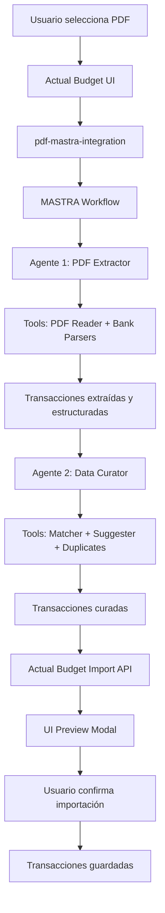

# Plan Estratégico y Técnico: Importación de PDFs Bancarios para Actual Budget

## 🎯 Resumen Ejecutivo

**Objetivo:** Desarrollar una funcionalidad modular que permita a usuarios del mercado español importar extractos bancarios en formato PDF (Banco Santander y Revolut) directamente en Actual Budget, utilizando agentes de IA desarrollados con MASTRA para extracción y curación automática de transacciones.

**Enfoque:** Mantener compatibilidad upstream, desarrollo modular con MASTRA, y experiencia de usuario fluida con mínimos cambios en la UI existente.

**Stack Principal:** MASTRA AI Agents + Actual Budget + TypeScript + React

---

## 📋 1. Análisis del Producto Base

### 1.1 Arquitectura Actual de Importación
Actual Budget ya tiene un sistema robusto de importación de transacciones que soporta:
- **Formatos:** CSV, QIF, OFX, QFX, TSV, XML  
- **Flujo:** `ImportTransactionsModal` → Parse → Preview → Validate → Import
- **Ubicación clave:** `packages/desktop-client/src/components/modals/ImportTransactionsModal/`

### 1.2 Puntos de Extensión Identificados
- **Backend:** `packages/loot-core/src/server/importers/`
- **Frontend:** Modal de importación existente
- **API:** `api/transactions-import` endpoint ya disponible

### 1.3 Integración MASTRA Existente
- **Ubicación MASTRA:** `../mastra-actual_finance_sr/`
- **MCP Server:** Disponible en IDE para consultas de documentación
- **Playground:** Configurado para testing y evaluación de agentes

---

## 🎯 2. Objetivos y Métricas de Éxito

### 2.1 Objetivos Primarios
1. **Importación PDF:** 100% de PDFs de Santander y Revolut procesados correctamente
2. **Curación IA:** >90% de transacciones categorizadas automáticamente con confianza alta
3. **UX Fluida:** <10 clicks para completar importación con validación
4. **Compatibilidad:** 0 conflictos con versión upstream de Actual Budget

### 2.2 Métricas de Éxito
- **Precisión de extracción:** >99% de transacciones extraídas correctamente
- **Tiempo de procesamiento:** <300 segundos por PDF promedio
- **Satisfacción del usuario:** >90% de transacciones aprobadas sin edición manual
- **Estabilidad:** 0 regresiones en funcionalidades existentes

### 2.3 Jobs-to-be-Done
**✅ Incluir:**
- Extraer transacciones de PDFs bancarios españoles mediante agentes IA
- Curar automáticamente payees y categorías con segundo agente
- Detectar y evitar duplicados
- Validar transacciones antes de importar
- Orquestar interacción secuencial entre agentes

**❌ Excluir explícitamente:**
- Parsers de PDF independientes (todo se maneja via tools de agentes)
- Soporte para otros bancos (fuera del scope inicial)
- Modificación de funcionalidades core de Actual Budget
- Integraciones bancarias en tiempo real
- Cambios en el modelo de datos existente

---

## 🏗️ 3. Arquitectura Técnica con MASTRA

### 3.1 Estructura MASTRA
```
mastra-actual_finance_sr/           # Proyecto MASTRA principal
├── mastra.config.ts                # Configuración MASTRA
├── agents/
│   ├── pdf-extractor-agent/        # 🆕 Agente 1: Extracción PDF
│   │   ├── agent.ts
│   │   ├── tools/
│   │   │   ├── pdf-reader.ts       # Tool: Lectura de PDF
│   │   │   ├── santander-parser.ts # Tool: Parser Santander
│   │   │   └── revolut-parser.ts   # Tool: Parser Revolut
│   │   └── prompts/
│   │       └── extraction.md
│   └── data-curator-agent/         # 🆕 Agente 2: Curación de datos
│       ├── agent.ts
│       ├── tools/
│       │   ├── payee-matcher.ts    # Tool: Matching de payees
│       │   ├── category-suggester.ts # Tool: Sugerencias categoría
│       │   └── duplicate-detector.ts # Tool: Detección duplicados
│       └── prompts/
│           └── curation.md
├── workflows/
│   └── pdf-import-workflow.ts      # 🆕 Orquestación de agentes
└── evaluations/
    ├── extraction-eval.ts          # Evaluaciones agente extractor
    └── curation-eval.ts           # Evaluaciones agente curador
```

### 3.2 Integración con Actual Budget
```
packages/
├── pdf-mastra-integration/         # 🆕 Módulo de integración
│   ├── package.json
│   ├── src/
│   │   ├── mastra-client.ts        # Cliente para comunicación con MASTRA
│   │   ├── workflow-orchestrator.ts # Orquestador del flujo completo
│   │   └── types/
│   │       └── pdf-transaction.ts  # Tipos compartidos
└── loot-core/
    └── src/server/importers/
        └── pdf.ts                  # 🆟 Integración con core de Actual
```

### 3.3 Flujo de Datos Completo


### 3.4 Configuración MCP Server
El MCP Server ya instalado permitirá:
- Consulta de documentación MASTRA en tiempo real
- Generación de código para agentes y tools
- Acceso a ejemplos y mejores prácticas
- Debugging y troubleshooting de agentes

---

## 🛠️ 4. Plan de Desarrollo Detallado

### 4.1 Sprint 1: Agente PDF Extractor Aislado

**Objetivo:** Crear y validar el primer agente en el playground de MASTRA

**Entregables:**
- [ ] Configuración del agente PDF Extractor en MASTRA
- [ ] Desarrollo de tools para lectura y parsing de PDFs
- [ ] Testing en MASTRA Playground con traces detallados
- [ ] Evaluaciones (evals) para medir precisión de extracción
- [ ] Documentación de prompts y configuración del agente

**Tareas técnicas:**
```typescript
// agents/pdf-extractor-agent/agent.ts
import { Agent } from '@mastra/core';
import { pdfReaderTool } from './tools/pdf-reader';
import { santanderParserTool } from './tools/santander-parser';
import { revolutParserTool } from './tools/revolut-parser';

export const pdfExtractorAgent = new Agent({
  name: 'PDF_EXTRACTOR',
  instructions: `
    Eres un especialista en extracción de datos de extractos bancarios PDF.
    Tu objetivo es identificar y estructurar todas las transacciones financieras
    contenidas en PDFs de Banco Santander y Revolut.
  `,
  tools: [pdfReaderTool, santanderParserTool, revolutParserTool]
});
```

**Testing en Playground:**
- Cargar PDFs de prueba de ambos bancos
- Verificar traces de ejecución de cada tool
- Medir precisión de extracción con métricas definidas
- Ajustar prompts basado en resultados

### 4.2 Sprint 2: Agente Data Curator Aislado

**Objetivo:** Crear y validar el segundo agente de forma independiente

**Entregables:**
- [ ] Configuración del agente Data Curator en MASTRA  
- [ ] Desarrollo de tools para curación de datos
- [ ] Testing aislado con datos estructurados del primer agente
- [ ] Evaluaciones para medir calidad de curación
- [ ] Documentación de lógica de matching y sugerencias

**Tareas técnicas:**
```typescript
// agents/data-curator-agent/agent.ts
import { Agent } from '@mastra/core';
import { payeeMatcherTool } from './tools/payee-matcher';
import { categorySuggesterTool } from './tools/category-suggester';
import { duplicateDetectorTool } from './tools/duplicate-detector';

export const dataCuratorAgent = new Agent({
  name: 'DATA_CURATOR',
  instructions: `
    Eres un especialista en curación de datos financieros.
    Tu objetivo es enriquecer las transacciones extraídas con información
    contextual, detectar duplicados y sugerir categorizaciones inteligentes.
  `,
  tools: [payeeMatcherTool, categorySuggesterTool, duplicateDetectorTool]
});
```

**Testing independiente:**
- Usar outputs del primer agente como inputs
- Validar lógica de matching con datos existentes de Actual
- Verificar detección de duplicados
- Evaluar calidad de sugerencias de categorización

### 4.3 Sprint 3: Workflow de Orquestación

**Objetivo:** Conectar ambos agentes en un workflow secuencial

**Entregables:**
- [ ] Desarrollo del workflow que orquesta ambos agentes
- [ ] Manejo de errores y estados intermedios
- [ ] Testing de flujo completo en MASTRA Playground
- [ ] Evaluaciones end-to-end del proceso completo
- [ ] Documentación de interacciones entre agentes

**Tareas técnicas:**
```typescript
// workflows/pdf-import-workflow.ts
import { Workflow } from '@mastra/core';
import { pdfExtractorAgent } from '../agents/pdf-extractor-agent';
import { dataCuratorAgent } from '../agents/data-curator-agent';

export const pdfImportWorkflow = new Workflow({
  name: 'PDF_IMPORT_WORKFLOW',
  steps: [
    {
      agent: pdfExtractorAgent,
      input: 'pdfBuffer',
      output: 'rawTransactions'
    },
    {
      agent: dataCuratorAgent,
      input: 'rawTransactions',
      output: 'curatedTransactions'
    }
  ]
});
```

**Validación de interacción:**
- Verificar que outputs del Agente 1 son inputs válidos para Agente 2
- Manejar casos de error en cualquier paso del workflow
- Optimizar rendimiento de la secuencia completa
- Documentar formato de datos entre agentes

### 4.4 Sprint 4: Integración con Actual Budget

**Objetivo:** Conectar el workflow MASTRA con Actual Budget

**Entregables:**
- [ ] Módulo de integración `pdf-mastra-integration`
- [ ] Cliente para comunicación con workflow MASTRA
- [ ] Extensión del ImportTransactionsModal para PDFs
- [ ] API integration con endpoints existentes de Actual
- [ ] Testing de integración completa

**Tareas técnicas:**
```typescript
// packages/pdf-mastra-integration/src/mastra-client.ts
export class MastraClient {
  async processPDF(pdfBuffer: Buffer, bankType: BankType): Promise<CuratedTransaction[]> {
    const workflowResult = await this.mastraWorkflow.execute({
      pdfBuffer,
      bankType,
      contextData: await this.getActualBudgetContext()
    });
    
    return workflowResult.curatedTransactions;
  }
  
  private async getActualBudgetContext() {
    // Obtener payees, categorías y transacciones existentes de Actual
    return {
      existingPayees: await this.actualAPI.getPayees(),
      existingCategories: await this.actualAPI.getCategories(),
      recentTransactions: await this.actualAPI.getRecentTransactions()
    };
  }
}
```

### 4.5 Sprint 5: UI/UX y Testing Final

**Objetivo:** Completar la experiencia de usuario y testing exhaustivo

**Entregables:**
- [ ] UI completa para preview y selección de transacciones
- [ ] Manejo de estados de loading y error
- [ ] Testing con repositorio completo de 20 PDFs
- [ ] Tests de regresión para funcionalidades existentes
- [ ] Documentación de usuario final

---

## ⚙️ 5. Especificaciones Técnicas de Agentes

### 5.1 Agente 1: PDF Extractor
```typescript
// Tools del agente extractor
interface PDFReaderTool {
  name: 'pdf_reader';
  description: 'Lee y extrae texto de archivos PDF bancarios';
  parameters: {
    pdfBuffer: Buffer;
    extractOptions: {
      preserveLayout: boolean;
      includePositions: boolean;
    };
  };
}

interface SantanderParserTool {
  name: 'santander_parser';
  description: 'Parsea extractos específicos de Banco Santander';
  parameters: {
    rawText: string;
    pageLayout: PDFLayout[];
  };
}

interface RevolutParserTool {
  name: 'revolut_parser';
  description: 'Parsea extractos específicos de Revolut';
  parameters: {
    rawText: string;
    pageLayout: PDFLayout[];
  };
}
```

**Prompt del Agente:**
```markdown
# PDF Transaction Extractor Agent

Eres un especialista en extracción de datos financieros de extractos bancarios PDF.

## Tu Misión
Extraer todas las transacciones financieras de PDFs de Banco Santander y Revolut
con la mayor precisión posible, estructurando la información en formato JSON. Leer la totalidad del PDF identificando transacciones, no detenerse de forma arbitraria. Validar la cantidad de transacciones extraidas.

## Tools Disponibles
1. `pdf_reader` - Lee el contenido del PDF
2. `santander_parser` - Parsea formato específico de Santander  
3. `revolut_parser` - Parsea formato específico de Revolut

## Proceso de Trabajo
1. Usa `pdf_reader` para extraer texto del PDF
2. Identifica el banco basándote en headers y formato
3. Aplica el parser correspondiente (santander_parser o revolut_parser)
4. Estructura cada transacción con: fecha, descripción, importe, saldo
5. Asigna score de confianza a cada transacción extraída
6. Valida la cantidad de transacciones extraidas contra el PDF original.

## Formato de Output
```json
{
  "bankType": "santander" | "revolut",
  "extractionDate": "ISO_DATE",
  "transactions": [
    {
      "date": "YYYY-MM-DD",
      "description": "string",
      "amount": number,
      "balance": number,
      "rawText": "string",
      "confidence": 0.0-1.0,
      "transactionId": "string"
    }
  ],
  "metadata": {
    "totalTransactions": number,
    "averageConfidence": number,
    "processingTime": number
  }
}
```


### 5.2 Agente 2: Data Curator
```typescript
// Tools del agente curador
interface PayeeMatcherTool {
  name: 'payee_matcher';
  description: 'Matches transacciones con payees existentes en Actual Budget';
  parameters: {
    transactionDescription: string;
    existingPayees: ActualPayee[];
    fuzzyThreshold: number;
  };
}

interface CategorySuggesterTool {
  name: 'category_suggester';
  description: 'Sugiere categorías basado en historial de transacciones';
  parameters: {
    payee: string;
    amount: number;
    description: string;
    historicalTransactions: ActualTransaction[];
  };
}

interface DuplicateDetectorTool {
  name: 'duplicate_detector';
  description: 'Detecta transacciones duplicadas comparando con existentes';
  parameters: {
    newTransaction: PDFTransaction;
    existingTransactions: ActualTransaction[];
    dateThreshold: number; // días
    amountThreshold: number; // porcentaje
  };
}
```

**Prompt del Agente:**
```markdown
# Data Curation Agent

Eres un especialista en curación y enriquecimiento de datos financieros.

## Tu Misión  
Enriquecer transacciones extraídas de PDFs con información contextual,
detectar duplicados y sugerir categorizaciones inteligentes para importación
optimizada en Actual Budget.

## Tools Disponibles
1. `payee_matcher` - Matches con payees existentes usando fuzzy matching
2. `category_suggester` - Sugiere categorías basado en historial
3. `duplicate_detector` - Detecta posibles duplicados

## Proceso de Trabajo
1. Para cada transacción extraída:
   - Usa `payee_matcher` para encontrar payee existente o sugerir nuevo
   - Usa `category_suggester` para proponer categoría más probable
   - Usa `duplicate_detector` para verificar si ya existe
2. Asigna niveles de confianza a cada sugerencia
3. Marca transacciones que requieren revisión manual

## Criterios de Calidad
- Confianza alta: >0.8 (auto-aprobar)
- Confianza media: 0.5-0.8 (mostrar sugerencia)
- Confianza baja: <0.5 (marcar para revisión manual)

## Formato de Output
```json
{
  "curatedTransactions": [
    {
      "originalTransaction": PDFTransaction,
      "suggestedPayee": {
        "name": "string",
        "confidence": number,
        "isExisting": boolean
      },
      "suggestedCategory": {
        "name": "string",
        "confidence": number,
        "reasoning": "string"
      },
      "duplicateCheck": {
        "isDuplicate": boolean,
        "confidence": number,
        "matchedTransactionId": "string?"
      },
      "recommendedAction": "auto_approve" | "review" | "skip",
      "flagsForReview": string[]
    }
  ],
  "summary": {
    "totalProcessed": number,
    "autoApprove": number,
    "needsReview": number,
    "duplicatesDetected": number
  }
}
```

---

## 🧪 6. Estrategia de Testing y Evaluación

### 6.1 Testing en MASTRA Playground

**Evaluación Agente Extractor:**
```typescript
// evaluations/extraction-eval.ts
export const extractionEval = {
  name: 'PDF_EXTRACTION_ACCURACY',
  testCases: [
    {
      input: 'santander-basic-statement.pdf',
      expected: expectedTransactions_santander_basic,
      metrics: ['precision', 'recall', 'f1_score']
    },
    {
      input: 'revolut-multi-currency.pdf', 
      expected: expectedTransactions_revolut_multi,
      metrics: ['precision', 'recall', 'f1_score']
    }
  ],
  thresholds: {
    precision: 0.95,
    recall: 0.90,
    f1_score: 0.92
  }
};
```

**Evaluación Agente Curador:**
```typescript
// evaluations/curation-eval.ts
export const curationEval = {
  name: 'DATA_CURATION_QUALITY',
  testCases: [
    {
      input: extractedTransactionsSample,
      actualBudgetContext: mockActualContext,
      expected: expectedCuratedOutput,
      metrics: ['payee_accuracy', 'category_accuracy', 'duplicate_detection']
    }
  ],
  thresholds: {
    payee_accuracy: 0.85,
    category_accuracy: 0.80,
    duplicate_detection: 0.95
  }
};
```

### 6.2 Repositorio de PDFs de Prueba
```
F1_PDF_IMPORTER/test-data/
├── santander/
│   ├── 01-basic-statement.pdf          # Caso básico
│   ├── 02-multi-page.pdf               # Múltiples páginas  
│   ├── 03-special-characters.pdf       # Caracteres especiales
│   ├── 04-different-formats.pdf        # Variaciones de formato
│   └── 05-edge-cases.pdf               # Casos extremos
├── revolut/
│   ├── 01-standard-personal.pdf        # Cuenta personal estándar
│   ├── 02-business-account.pdf         # Cuenta business
│   ├── 03-multi-currency.pdf           # Múltiples monedas
│   ├── 04-crypto-transactions.pdf      # Transacciones crypto
│   └── 05-international-transfers.pdf  # Transferencias internacionales
└── expected-outputs/
    ├── santander-01-expected.json
    ├── revolut-01-expected.json
    └── ...
```

### 6.3 Métricas de Evaluación
- **Precisión de Extracción:** % de transacciones correctamente identificadas
- **Completitud:** % de transacciones extraídas vs. total real  
- **Precisión de Curación:** % de sugerencias de payee/categoría correctas
- **Detección de Duplicados:** % de duplicados correctamente identificados
- **Tiempo de Procesamiento:** Segundos promedio por PDF
- **Tasa de Revisión Manual:** % de transacciones que requieren intervención

---

## 🔒 7. Estrategia de Compatibilidad Upstream

### 7.1 Principios de Diseño
- **Separación total:** MASTRA workflow completamente independiente
- **Integración mínima:** Solo un nuevo tipo de archivo ('pdf') en Actual
- **Feature flags:** Funcionalidad PDF totalmente opcional
- **APIs estándar:** Usar endpoints existentes de importación

### 7.2 Puntos de Integración Mínimos
```typescript
// Único cambio en código base de Actual
function getFileType(filename: string): FileType {
  if (filename.toLowerCase().endsWith('.pdf')) return 'pdf';
  // ... resto del código existente sin cambios
}

// Nueva opción en file picker
const PDF_IMPORT_ENABLED = process.env.ENABLE_PDF_IMPORT === 'true';
```

### 7.3 Arquitectura de Comunicación
```typescript
// Comunicación vía API REST estándar
interface MastraIntegration {
  processPDF(buffer: Buffer): Promise<ActualTransaction[]>;
  // No hay dependencias directas en código core de Actual
}
```

---

## 🚀 8. Configuración de Entorno de Desarrollo

### 8.1 Setup MASTRA
```bash
# Navegar a proyecto MASTRA
cd ../mastra-actual_finance_sr

# Instalar dependencias
npm install

# Configurar agentes
npx mastra init agents pdf-extractor-agent
npx mastra init agents data-curator-agent  
npx mastra init workflows pdf-import-workflow

# Iniciar playground para testing
npx mastra playground
```

### 8.2 Variables de Entorno
```env
# MASTRA Configuration
OPENAI_API_KEY=your_api_key (ya configurada dentro de la carpeta de MASTRA)
MASTRA_WORKSPACE_PATH=../mastra-actual_finance_sr

# Feature Flags
ENABLE_PDF_IMPORT=true
PDF_AGENT_ENDPOINT=http://localhost:3000/workflows/pdf-import

# Actual Budget Integration  
ACTUAL_BUDGET_API_URL=http://localhost:5006
```

### 8.3 Comandos de Desarrollo
```bash
# Desarrollo en MASTRA (aislado)
cd ../mastra-actual_finance_sr
npm run dev                    # Iniciar agentes en desarrollo
npm run playground            # Abrir playground para testing
npm run eval:extraction       # Ejecutar evaluaciones de extracción
npm run eval:curation        # Ejecutar evaluaciones de curación

# Desarrollo en Actual Budget (integración)
cd personal-finance-actual_SR  
npm run dev:with-pdf          # Iniciar con soporte PDF habilitado
npm run test:pdf-integration  # Tests de integración completa
```

---

## 📚 9. Recursos y Documentación

### 9.1 Documentación MASTRA
- **MCP Server:** Disponible en IDE para consultas en tiempo real
- **Playground:** Interfaz visual para testing y debugging de agentes
- **Traces:** Monitoreo detallado de ejecución de tools y agentes
- **Evaluations:** Framework para testing automatizado de calidad

### 9.2 Referencias Técnicas
- **Actual Budget API:** Endpoints existentes para importación
- **PDF.js:** Librería para procesamiento de PDFs (ya instalada)
- **Fuzzy Matching:** Algoritmos para matching de payees
- **Duplicate Detection:** Lógica de detección basada en similitud

### 9.3 Mejores Prácticas MASTRA
- **Prompts:** Usar markdown para instrucciones claras y estructuradas
- **Tools:** Una responsabilidad por tool, interfaces limpias
- **Workflows:** Manejar errores y estados intermedios correctamente
- **Evaluations:** Testing continuo con métricas cuantificables

---

## ⚠️ 10. Gestión de Riesgos

### 10.1 Riesgos Técnicos
| Riesgo | Probabilidad | Impacto | Mitigación |
|--------|--------------|---------|------------|
| Cambios en formato PDF bancario | Media | Alto | Agentes adaptables, tools modulares |
| Performance con PDFs grandes | Media | Medio | Límites de tamaño, procesamiento optimizado |
| Precisión IA insuficiente | Baja | Alto | Evaluaciones continuas, mejora iterativa |
| Conflictos upstream Actual | Muy Baja | Alto | Integración mínima, feature flags |

### 10.2 Plan de Contingencia
- **Formato PDF cambia:** Actualizar prompts y tools específicos
- **Performance issues:** Implementar streaming y límites
- **IA accuracy baja:** Fallback a modo manual con asistencia IA
- **Upstream conflicts:** Separación completa vía APIs

---

## 🎯 11. Hitos y Entregables

### Milestone 1: Agentes Aislados Funcionales
- ✅ Agente PDF Extractor validado en playground
- ✅ Agente Data Curator validado en playground  
- ✅ Evaluaciones automatizadas con métricas objetivo
- ✅ Workflow de orquestación funcionando

### Milestone 2: Integración con Actual Budget
- ✅ Módulo de integración `pdf-mastra-integration`
- ✅ UI/UX completa para importación PDF
- ✅ Testing end-to-end con repositorio de PDFs
- ✅ Documentación técnica completa

### Milestone 3: Producción Ready
- ✅ Soporte completo para Santander y Revolut
- ✅ Performance optimizada (<30s por PDF)
- ✅ Testing exhaustivo sin regresiones
- ✅ Deployment en Fly.io con feature flag

---

Este plan estratégico y técnico actualizado refleja el enfoque MASTRA-first, con desarrollo aislado de agentes, testing riguroso en playground, y integración mínima con Actual Budget para mantener compatibilidad upstream. La separación clara entre la lógica de IA (MASTRA) y la aplicación financiera (Actual Budget) asegura escalabilidad y mantenibilidad a largo plazo.
