# Fase 2: Diagramas de Arquitectura

## Agente de Categorización Inteligente

**Versión:** 2.0  
**Fecha:** Octubre 2025  
**Visualizaciones:** Mermaid Diagrams

---

## 📋 Tabla de Contenidos

1. [Diagrama de Arquitectura General](#diagrama-de-arquitectura-general)
2. [Diagrama de Secuencia Completo](#diagrama-de-secuencia-completo)
3. [Diagrama de Base de Datos](#diagrama-de-base-de-datos)
4. [Diagrama de Flujo de Decisión](#diagrama-de-flujo-de-decisión)
5. [Diagrama de Componentes Frontend](#diagrama-de-componentes-frontend)

---

## 🏗️ Diagrama de Arquitectura General

```mermaid
graph TB
    subgraph \"Browser\"
        UI[ImportTransactionsModal.tsx]
        UI_State[React State]
        UI --> UI_State
    end

    subgraph \"Actual Budget App (actual-budget-sr.fly.dev)\"
        SyncServer[Sync Server<br/>Express.js<br/>Port 5006]
        SQLite[(SQLite Database<br/>transactions<br/>categories<br/>rules<br/>payees)]

        API_Categories[API: GET /api/categories/:id]
        API_Transactions[API: GET /api/transactions/search]
        API_Rules[API: GET /api/rules/:id]

        SyncServer --> API_Categories
        SyncServer --> API_Transactions
        SyncServer --> API_Rules

        API_Categories --> SQLite
        API_Transactions --> SQLite
        API_Rules --> SQLite
    end

    subgraph \"Agent Server (actual-agent-sr.fly.dev)\"
        AgentExpress[Express.js<br/>Port 4000]

        Agent1[Agent 1: PDF Parser<br/>POST /api/process-pdf]
        Agent2[Agent 2: Categorizer<br/>POST /api/suggest-categories]

        SearchModule[Search Module<br/>fuzzy matching<br/>Levenshtein]
        PromptModule[Prompt Builder<br/>context optimization]

        AgentExpress --> Agent1
        AgentExpress --> Agent2
        Agent2 --> SearchModule
        Agent2 --> PromptModule
    end

    subgraph \"Anthropic\"
        Claude[Claude API<br/>claude-3-5-sonnet-20241022]
    end

    UI -->|1. Upload PDF| Agent1
    Agent1 -->|PDF Vision| Claude
    Claude -->|Transactions| Agent1
    Agent1 -->|2. JSON| UI

    UI -->|3. Click \"Sugerir Categorías\"| Agent2
    Agent2 -->|4. Fetch Categories| API_Categories
    Agent2 -->|5. Search Similar Txs| API_Transactions
    Agent2 -->|6. Fetch Rules| API_Rules

    Agent2 -->|7. Categorization Request| Claude
    Claude -->|8. Suggestions| Agent2
    Agent2 -->|9. JSON with Categories| UI

    style Agent1 fill:#90EE90
    style Agent2 fill:#FFD700
    style Claude fill:#FF6B6B
    style SQLite fill:#4A90E2
```

---

## 🔄 Diagrama de Secuencia Completo


---

## 🗄️ Diagrama de Base de Datos

```mermaid
erDiagram
    TRANSACTIONS ||--o{ CATEGORIES : \"has\"
    TRANSACTIONS ||--o{ PAYEES : \"has\"
    TRANSACTIONS }o--|| ACCOUNTS : \"belongs to\"
    CATEGORIES }o--|| CATEGORY_GROUPS : \"belongs to\"
    RULES ||--o{ CATEGORIES : \"assigns\"

    TRANSACTIONS {
        text id PK
        text account FK
        integer date
        integer amount
        text payee FK
        text category FK
        text notes
        boolean cleared
        boolean is_parent
        integer tombstone
    }

    CATEGORIES {
        text id PK
        text name
        boolean is_income
        text group_id FK
        integer sort_order
        integer tombstone
    }

    CATEGORY_GROUPS {
        text id PK
        text name
        boolean is_income
        integer sort_order
        integer tombstone
    }

    PAYEES {
        text id PK
        text name
        text transfer_acct
        integer tombstone
    }

    ACCOUNTS {
        text id PK
        text name
        text offbudget
        boolean closed
        integer tombstone
    }

    RULES {
        text id PK
        text stage
        text conditions
        text actions
        integer sort_order
        integer tombstone
    }
```

### Queries Clave para el Agente 2


---

## 🧠 Diagrama de Flujo de Decisión

```mermaid
flowchart TD
    Start([Nueva Transacción]) --> GetPayee[Obtener Payee Name]
    GetPayee --> CheckRules{Existe regla<br/>que coincida?}

    CheckRules -->|Sí| ApplyRule[Aplicar Regla<br/>Confidence: 98%]
    ApplyRule --> ReturnSuggestion([Retornar Sugerencia])

    CheckRules -->|No| SearchExact[Búsqueda Exacta<br/>en Histórico]
    SearchExact --> CheckExactResults{¿Encontró<br/>≥5 matches?}

    CheckExactResults -->|Sí| CalcFrequency[Calcular Categoría<br/>Más Frecuente]
    CalcFrequency --> CheckFreqThreshold{Frecuencia<br/>≥3?}

    CheckFreqThreshold -->|Sí| AutoCategorize[Auto-categorizar<br/>Confidence: 95%<br/>SIN llamar Claude]
    AutoCategorize --> ReturnSuggestion

    CheckFreqThreshold -->|No| CallClaude
    CheckExactResults -->|No| SearchFuzzy[Búsqueda Fuzzy<br/>con Keywords]

    SearchFuzzy --> CheckFuzzyResults{¿Encontró<br/>≥3 matches?}
    CheckFuzzyResults -->|Sí| CallClaude[Llamar Claude API<br/>con contexto]
    CheckFuzzyResults -->|No| CheckHistory{¿DB tiene<br/>histórico?}

    CheckHistory -->|Sí| CallClaude
    CheckHistory -->|No| UseDefaults[Usar Mapping<br/>Genérico]

    CallClaude --> ParseResponse[Parse JSON<br/>Response]
    ParseResponse --> CheckConfidence{Confidence<br/>≥0.5?}

    CheckConfidence -->|Sí| MapCategory[Mapear a<br/>Category ID]
    CheckConfidence -->|No| ReturnNull[category: null<br/>reasoning: unclear]

    MapCategory --> ReturnSuggestion
    ReturnNull --> ReturnSuggestion
    UseDefaults --> ReturnSuggestion

    style ApplyRule fill:#90EE90
    style AutoCategorize fill:#90EE90
    style CallClaude fill:#FFD700
    style ReturnNull fill:#FFB6C1
```



---

## 🎨 Diagrama de Componentes Frontend

```mermaid
graph TB
    subgraph \"ImportTransactionsModal.tsx\"
        Modal[Modal Component]
        State[React State]

        subgraph \"State Management\"
            S1[transactions: Transaction[]]
            S2[isSuggestingCategories: bool]
            S3[categorySuggestions: Map]
            S4[error: Error | null]
        end

        subgraph \"UI Components\"
            Table[Transaction Table]
            SuggestBtn[Button: Sugerir Categorías]
            ImportBtn[Button: Import]
            LoadingSpinner[Loading Spinner]
        end

        subgraph \"Transaction Row\"
            TxRow[Transaction Component]
            TxData[Date | Payee | Notes | Amount]
            TxSuggestion[AI Suggestion Display]

            subgraph \"Suggestion Display\"
                Icon[🤖 Icon]
                CategoryName[Category Name]
                Badge[Confidence Badge<br/>Success/Warning/Error]
                Reasoning[ℹ️ Reasoning Text]
            end
        end
    end

    Modal --> State
    State --> S1
    State --> S2
    State --> S3
    State --> S4

    Modal --> Table
    Modal --> SuggestBtn
    Modal --> ImportBtn

    Table --> TxRow
    TxRow --> TxData
    TxRow --> TxSuggestion

    TxSuggestion --> Icon
    TxSuggestion --> CategoryName
    TxSuggestion --> Badge
    TxSuggestion --> Reasoning

    SuggestBtn -->|onClick| HandleSuggest[handleSuggestCategories]
    HandleSuggest -->|setState| S2
    HandleSuggest -->|fetch| Agent2API[Agent 2 API]
    Agent2API -->|response| ParseSuggestions[Parse & Apply]
    ParseSuggestions -->|setState| S3
    ParseSuggestions -->|update| S1

    S2 -->|true| LoadingSpinner
    S3 -->|Map| TxSuggestion

    style SuggestBtn fill:#FFD700
    style TxSuggestion fill:#E6F3FF
    style Badge fill:#90EE90
```

### Estado de Componentes

```mermaid
stateDiagram-v2
    [*] --> Initial: Modal Opens
    Initial --> Parsing: Upload PDF
    Parsing --> Loaded: Parse Complete

    Loaded --> Suggesting: Click \"Sugerir Categorías\"
    Suggesting --> Categorized: Suggestions Received
    Categorized --> Loaded: User Edits

    Loaded --> Importing: Click \"Import\"
    Categorized --> Importing: Click \"Import\"
    Importing --> [*]: Success

    Parsing --> Error: Parse Failed
    Suggesting --> Error: API Failed
    Error --> Loaded: Retry

    note right of Suggesting
        - Show spinner
        - Disable button
        - Call Agent 2 API
    end note

    note right of Categorized
        - Show suggestions
        - Display confidence
        - Allow edits
    end note
```



---

## 🔄 Diagrama de Flujo de Datos

```mermaid
flowchart LR
    subgraph \"Input\"
        PDF[PDF File]
        UserDB[(User's<br/>Database)]
    end

    subgraph \"Processing\"
        A1[Agent 1:<br/>Extract Txs]
        A2[Agent 2:<br/>Suggest Cats]

        subgraph \"Agent 2 Internal\"
            Fetch[Fetch Context]
            Search[Search History]
            Decide[Decision Logic]
            AI[Claude API]
        end
    end

    subgraph \"Output\"
        UI[UI with<br/>Suggestions]
        Import[Final Import]
    end

    PDF --> A1
    A1 -->|transactions[]| UI

    UI -->|trigger| A2
    UserDB -->|categories| Fetch
    UserDB -->|rules| Fetch
    UserDB -->|history| Search

    A2 --> Fetch
    A2 --> Search
    Fetch --> Decide
    Search --> Decide

    Decide -->|known payee| A2
    Decide -->|uncertain| AI
    AI --> A2

    A2 -->|suggestions[]| UI
    UI -->|reviewed txs| Import
    Import --> UserDB

    style A1 fill:#90EE90
    style A2 fill:#FFD700
    style AI fill:#FF6B6B
    style UserDB fill:#4A90E2
```

---

## 📊 Diagrama de Performance

```mermaid
gantt
    title Timeline de Procesamiento (50 transacciones)
    dateFormat X
    axisFormat %S

    section User Action
    Click \"Sugerir\" :milestone, m1, 0, 0

    section Agent 2
    Fetch Categories :a1, 0, 200ms
    Fetch Rules :a2, 200ms, 300ms
    Group by Payee :a3, 500ms, 100ms

    section Search (15 unique payees)
    Search Payee 1-5 :b1, 600ms, 500ms
    Search Payee 6-10 :b2, 1100ms, 500ms
    Search Payee 11-15 :b3, 1600ms, 500ms

    section Categorization
    Auto-categorize (35 txs) :c1, 2100ms, 200ms
    Claude API (15 txs) :c2, 2300ms, 2000ms

    section UI Update
    Apply suggestions :d1, 4300ms, 200ms
    Render UI :milestone, m2, 4500ms, 0

    section Total
    Total Time: 4.5 seconds :milestone, m3, 4500ms, 0
```

### Performance Breakdown


---

## 🔐 Diagrama de Seguridad


---

## 📝 Notas de Implementación

### Consideraciones Importantes

1. **Performance**: El diagrama de Gantt muestra el \"happy path\" con tiempos ideales. En producción, agregar +20-30% por latencia de red.

2. **Caching**: El diagrama de arquitectura no muestra caching explícitamente, pero está implementado en el código (ver `payeeContext` map).

3. **Error Handling**: Todos los diagramas muestran el flujo positivo. Cada paso tiene try-catch y error handling (ver código).

4. **Scaling**: Para >100 transacciones, considerar procesamiento en batches (no mostrado en diagramas por simplicidad).

5. **Database Indexes**: Los queries mostrados asumen índices en `payee`, `category`, `date`. Verificar con `EXPLAIN QUERY PLAN`.

---

## 🎯 Próximos Pasos

1. **Revisar diagramas** con el equipo
2. **Validar flujos** con casos de uso reales
3. **Implementar** siguiendo el PHASE_2_TECHNICAL_PLAN.md
4. **Testear** cada componente según los diagramas
5. **Optimizar** basándose en métricas de performance

---

**Generado:** Octubre 2025  
**Formato:** Mermaid (compatible con GitHub, GitLab, VS Code, etc.)  
**Editable:** Sí - ajustar según feedback de implementación
