# 📊 Actual Budget Enhancement: PDF Transaction Parser
## Product Strategy & Requirements Document

---

## 🎯 **Executive Summary**

### **Problem Statement**
Sebastian y María, usuarios target de Actual Budget, enfrentan un friction crítico en su flujo de gestión financiera: Santander España solo permite descargar movimientos bancarios en formato PDF, mientras que Actual Budget requiere formatos estructurados (CSV, QIF, OFX, QFX) para importación automática. Esto los obliga a realizar transcripción manual o abandonar el uso de la aplicación.

### **Solution Overview**
Implementación de un sistema de agentes AI dual utilizando MASTRA.AI que automatiza completamente la extracción, curación y categorización de transacciones desde PDFs bancarios, eliminando el friction manual y mejorando significativamente la experiencia del usuario.

### **Business Impact**
- **Expansión de mercado**: Acceso a usuarios de bancos que solo ofrecen PDFs (estimado: 40% del mercado español)
- **Reducción de churn**: Eliminación del principal punto de fricción identificado
- **Diferenciación competitiva**: Primera solución open-source con AI-powered PDF parsing
- **User engagement**: Incremento estimado del 60% en frecuencia de uso

---

## 📈 **Market Analysis & User Research**

### **Target User Profile**
```yaml
Primary Personas:
  Sebastian & María:
    - Age: 28-45
    - Income: €35K-80K annually
    - Tech Savviness: Medium
    - Financial Goals: Budget control, expense tracking
    - Pain Points: Manual data entry, time-consuming processes
    - Usage Pattern: 1-2 times per month
    - Bank: Santander España (PDF-only exports)
```

### **Competitive Landscape**
| Solution | PDF Support | AI Categorization | Open Source | Cost |
|----------|-------------|------------------|-------------|------|
| **Actual + Our Enhancement** | ✅ | ✅ | ✅ | Free |
| YNAB | ❌ | ✅ | ❌ | $14/month |
| Mint | ❌ | ✅ | ❌ | Free (ads) |
| MoneyMoney (DE) | ✅ | ✅ | ❌ | €29.99 |
| Local Fintech Solutions | ⚠️ | ⚠️ | ❌ | €5-15/month |

### **Market Opportunity**
- **TAM**: 12M Spanish banking customers
- **SAM**: 3.5M users with active budget management needs
- **SOM**: 280K potential Actual Budget users (8% adoption rate)

---

## 🏗️ **Technical Architecture**

### **System Design Overview**

```mermaid
graph TB
    subgraph "User Interface"
        UI[📱 Actual Budget Frontend]
        UPLOAD[📤 PDF Upload Component]
    end
    
    subgraph "MASTRA AI Agents"
        AGENT1[🤖 PDF Parser Agent<br/>RAG + OCR]
        AGENT2[🧠 Transaction Curator Agent<br/>Classification + Categorization]
    end
    
    subgraph "Processing Pipeline"
        PDF[📄 PDF Input]
        OCR[👁️ OCR Extraction]
        RAG[🧠 RAG Analysis]
        CSV[📊 Raw CSV Output]
        CURATOR[🔍 Data Curation]
        CLEAN_CSV[✨ Clean CSV Output]
    end
    
    subgraph "Storage & Integration"
        VECTOR_DB[(🗂️ Vector Database)]
        ACTUAL_DB[(💾 Actual SQLite)]
        TEMPLATES[📋 Bank Templates]
    end
    
    UI --> UPLOAD
    UPLOAD --> PDF
    PDF --> AGENT1
    AGENT1 --> OCR
    AGENT1 --> RAG
    RAG --> VECTOR_DB
    OCR --> CSV
    CSV --> AGENT2
    AGENT2 --> CURATOR
    CURATOR --> CLEAN_CSV
    CLEAN_CSV --> ACTUAL_DB
    TEMPLATES --> RAG
    
    style AGENT1 fill:#e1f5fe
    style AGENT2 fill:#e8f5e8
    style VECTOR_DB fill:#fff3e0
```



### **Agent Architecture Specifications**

#### **Agent 1: PDF Parser Agent (RAG Architecture)**
```typescript
// Using MASTRA.AI framework
const pdfParserAgent = new Agent({
  name: "PDF Transaction Parser",
  model: "gpt-4o",
  tools: {
    pdfOcrTool,
    bankTemplateMatchingTool,
    transactionExtractionTool
  },
  memory: new LibSQLStore({
    url: "file:pdf_parsing_memory.db"
  }),
  systemPrompt: `
    You are an expert PDF transaction parser specialized in Spanish banking documents.
    
    CAPABILITIES:
    - Extract transaction data from Spanish bank PDFs (Santander, BBVA, etc.)
    - Identify transaction patterns using OCR and template matching
    - Generate structured CSV output with: Date, Description, Amount, Account
    - Handle multi-page documents and complex layouts
    
    PROCESSING STEPS:
    1. Perform OCR on PDF pages
    2. Match against known bank statement templates
    3. Extract transaction blocks using pattern recognition
    4. Validate extracted data for completeness
    5. Output clean CSV format
  `
});
```

#### **Agent 2: Transaction Curator Agent**
```typescript
const transactionCuratorAgent = new Agent({
  name: "Transaction Curator & Categorizer",
  model: "gpt-4o", 
  tools: {
    payeeMatchingTool,
    categoryClassificationTool,
    duplicateDetectionTool,
    actualBudgetIntegrationTool
  },
  memory: new LibSQLStore({
    url: "file:curation_memory.db"
  }),
  systemPrompt: `
    You are an expert financial transaction curator for Spanish users.
    
    RESPONSIBILITIES:
    - Clean and standardize transaction descriptions
    - Identify and match payees (merchants, services, etc.)
    - Classify transactions into appropriate categories
    - Detect and handle duplicates
    - Prepare data for Actual Budget import
    
    SPANISH CONTEXT:
    - Recognize Spanish merchant names and services
    - Handle Spanish date formats (DD/MM/YYYY)
    - Understand Spanish transaction types (Transferencia, Recibo, etc.)
    - Apply Spanish spending categories (Alimentación, Transporte, etc.)
  `
});
```

---

## 🔧 **Implementation Roadmap**

### **Phase 1: MVP Foundation (Sprint 1-2)**
```yaml
Duration: 2-3 weeks
Key Deliverables:
  - MASTRA.AI integration into Actual Budget
  - Basic PDF upload interface
  - Agent 1: Simple OCR-based extraction
  - CSV output generation
  - Integration with existing import flow

Success Metrics:
  - Successfully parse 99% of Santander PDF statements
  - Extract transactions with 99% accuracy
  - End-to-end flow functional
```

### **Phase 2: Enhanced Intelligence (Sprint 3-4)**
```yaml
Duration: 2-3 weeks
Key Deliverables:
  - Agent 2: Smart categorization and curation
  - RAG implementation for bank template learning
  - Duplicate detection and merging
  - Payee matching and standardization
  - Multi-bank support (BBVA, CaixaBank)

Success Metrics:
  - 90% automatic categorization accuracy
  - 95% payee matching accuracy
  - Support for top 3 Spanish banks
```

### **Phase 3: Production Ready (Sprint 5-6)**
```yaml
Duration: 2-3 weeks
Key Deliverables:
  - Error handling and recovery
  - User feedback loops and corrections
  - Performance optimization
  - Security hardening
  - Documentation and testing

Success Metrics:
  - <120 second processing time per PDF
  - 99.9% uptime
  - Security audit passed
  - User acceptance > 85%
```

---

## 💻 **Technical Requirements**

### **Frontend Requirements**
```typescript
// New React component for PDF upload
interface PDFUploadProps {
  onUploadSuccess: (transactions: Transaction[]) => void;
  accountId: string;
}

// Integration points with existing Actual Budget
- Add PDF upload option to import transaction flow
- Progress indicator for AI processing
- Review/edit interface for AI-generated categorizations
- Batch approve/reject functionality
```

### **Backend Requirements**
```typescript
// MASTRA.AI Integration
dependencies: {
  "@mastra/core": "latest",
  "@mastra/memory": "latest", 
  "@mastra/mcp": "latest",
  "pdf-parse": "^1.1.1",
  "tesseract.js": "^5.0.0"
}

// API Endpoints
POST /api/upload-pdf
POST /api/process-transactions  
GET /api/processing-status/:jobId
POST /api/approve-transactions
```

### **Infrastructure Requirements**
```yaml
Storage:
  - Vector database for RAG (Pinecone or local SQLite vector)
  - Temporary PDF storage (24h retention)
  - Transaction staging area

Processing:
  - OCR processing capability
  - LLM API access (OpenAI GPT-4o)
  - Background job processing

Security:
  - PDF file validation and sanitization
  - Data encryption in transit and at rest
  - User data isolation
```

---

## 🧪 **Testing & Validation Strategy**

### **Agent Testing Framework**
```typescript
// Using MASTRA's eval system
const pdfParsingEvals = [
  {
    name: "Santander PDF Accuracy",
    dataset: "./test-data/santander-samples/",
    expectedAccuracy: 99,
    testCases: 50
  },
  {
    name: "Multi-bank Support", 
    dataset: "./test-data/various-banks/",
    expectedAccuracy: 90,
    testCases: 30
  }
];

const categorizationEvals = [
  {
    name: "Spanish Category Classification",
    dataset: "./test-data/spanish-transactions/",
    expectedAccuracy: 95,
    testCases: 200
  }
];
```

### **User Acceptance Testing**
- **Beta group**: 25 Santander España customers
- **Test scenarios**: Real PDF statements from last 6 months
- **Success criteria**: 
  - 85% user satisfaction score
  - 90% would recommend to others
  - <3% require manual corrections

---

## 📊 **Success Metrics & KPIs**

### **Technical KPIs**
```yaml
Performance:
  - PDF processing time: <120 seconds average
  - Transaction extraction accuracy: >95%
  - Categorization accuracy: >88%
  - System uptime: >99.9%

Quality:
  - False positive rate: <3%
  - User correction rate: <5%
  - Duplicate detection rate: >99%
```

---

## 🎨 **User Experience Design**

### **User Flow**


### **UI/UX Specifications**
- **Upload Interface**: Drag-and-drop PDF upload with progress indicator
- **AI Processing**: Real-time status updates with estimated completion time
- **Review Interface**: Table view with confidence scores and edit capabilities
- **Batch Actions**: Select all, approve all, category bulk assignment
- **Error Handling**: Clear error messages with suggested solutions

---

### **Operational Costs (Monthly)**
```yaml
LLM API Costs: €5/month
  - OpenAI GPT-4o: ~1,000 API calls
  - Vector embeddings: ~500 operations

Infrastructure: €50/month -> challenged!
  - Vector database hosting
  - Additional compute resources
  - Could we save if we use Fly.IO ?

Total Monthly: TBD
```

---

## 🚀 **Next Steps & Action Items**

### **Immediate Actions (Week 1)**
1. **Technical Setup**
   - [ ] Create MASTRA.AI development environment
   - [ ] Set up PDF processing pipeline prototype
   - [ ] Design agent interaction patterns

2. **Research & Validation**
   - [ ] Collect Santander PDF samples for testing
   - [ ] Interview 10 target users for requirements validation (not a blocker)

3. **Team Preparation**
   - [ ] Assign development resources
   - [ ] Set up testing environment
   - [ ] Create detailed technical specifications

### **Week 2-3: Development Kickoff**
- [ ] Implement Agent 1 (PDF Parser) basic functionality
- [ ] Create frontend upload interface
- [ ] Set up MASTRA.AI agent communication
- [ ] Begin testing with sample PDFs

### **Success Definition**
By end of Phase 1, we should have a working prototype that can:
- Accept PDF uploads from Santander España
- Extract transaction data with 80% accuracy
- Output CSV format compatible with Actual Budget
- Demonstrate end-to-end user flow

---

## 📋 **Appendices**

### **A. Technical Stack Details**
- **Framework**: MASTRA.AI for agent orchestration
- **LLM**: OpenAI GPT-4o for language understanding
- **OCR**: Tesseract.js for text extraction
- **Vector DB**: SQLite with vector extension for RAG
- **Frontend**: React components integrated with existing Actual Budget UI
- **Backend**: Node.js with Express integration

### **B. Risk Mitigation**
- **PDF Format Changes**: Robust template matching with fallback OCR
- **API Rate Limits**: Local caching and batch processing
- **Accuracy Issues**: User feedback loops and continuous learning


---

*Document Version: 1.0*  
*Last Updated: September 25, 2025*  
*Owner: Product Management*  
*Reviewers: Engineering, UX, Security*
